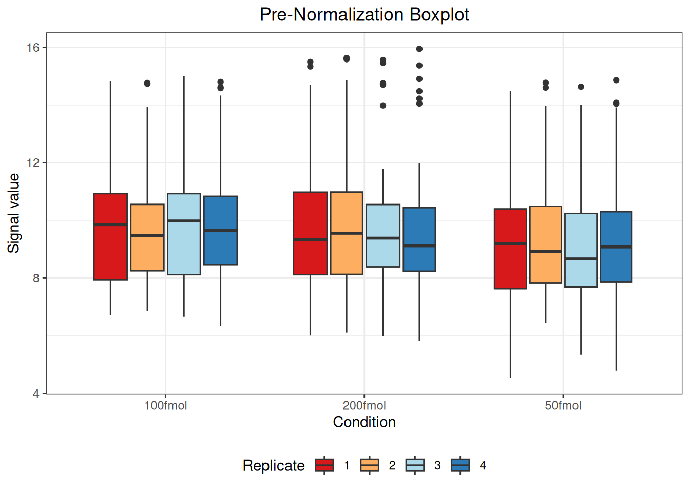
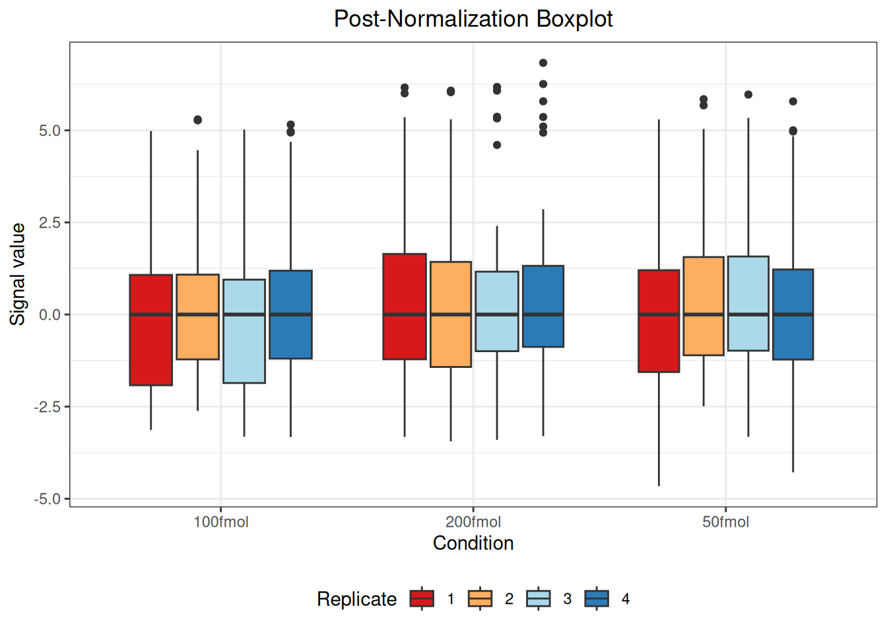

# Normalization

## Preliminary

``` r

## load R package
library(msDiaLogue)
## preprocessing
fileName <- "../inst/extdata/Spectronaut_HeLa6Mix_Data.csv"
dataSet <- preprocessing(fileName,
                         filterNaN = TRUE, filterUnique = 2,
                         replaceBlank = TRUE, saveRm = TRUE)
## transformation
dataTran <- transform(dataSet, logFold = 2)
## annotation-based filtering
dataFiltAnno <- filterOutIn(dataTran, listName = "ALBU_BOVIN",
                            removeList = TRUE, saveRm = TRUE)
```

## Example

``` r

dataNorm <- normalize(dataFiltAnno, normalizeType = "median")
#> Warning: Removed 55 rows containing non-finite outside the scale range
#> (`stat_boxplot()`).
```



    #> Warning: Removed 55 rows containing non-finite outside the scale range
    #> (`stat_boxplot()`).



The message “Warning: Removed 55 rows containing non-finite values
outside the scale range
([`stat_boxplot()`](https://ggplot2.tidyverse.org/reference/geom_boxplot.html))”
indicates the presence of 55 `NA` (Not Available) values in the data.
These `NA` values arise when a protein was not identified in a
particular sample or condition and are automatically excluded when
generating the boxplot but retained in the actual dataset.

| R.Condition | R.Replicate | NUD4B_HUMAN (+1) | A0A7P0T808_HUMAN (+1) | A0A8I5KU53_HUMAN (+1) | ZN840_HUMAN | CC85C_HUMAN | TMC5B_HUMAN | C9JEV0_HUMAN (+1) | C9JNU9_HUMAN | CYC_BOVIN | TRFE_BOVIN | KRT16_MOUSE | F8W0H2_HUMAN | H0Y7V7_HUMAN (+1) | H0YD14_HUMAN | H3BUF6_HUMAN | H7C1W4_HUMAN (+1) | H7C3M7_HUMAN | TCPR2_HUMAN | TLR3_HUMAN | LRIG2_HUMAN | RAB3D_HUMAN | ADH1_YEAST | LYSC_CHICK | BGAL_ECOLI | CYTA_HUMAN | KPCB_HUMAN | LIPL_HUMAN | PIP_HUMAN | CO6_HUMAN | BGAL_HUMAN | SYTC_HUMAN | CASPE_HUMAN | DCAF6_HUMAN | DALD3_HUMAN | HGNAT_HUMAN | RFFL_HUMAN | RN185_HUMAN | ZN462_HUMAN | ALKB7_HUMAN | POLK_HUMAN | ACAD8_HUMAN | A0A7I2PK40_HUMAN (+2) | NBDY_HUMAN | H0Y5R1_HUMAN (+1) |
|:---|:---|---:|---:|---:|---:|---:|---:|---:|---:|---:|---:|---:|---:|---:|---:|---:|---:|---:|---:|---:|---:|---:|---:|---:|---:|---:|---:|---:|---:|---:|---:|---:|---:|---:|---:|---:|---:|---:|---:|---:|---:|---:|---:|---:|---:|
| 100fmol | 1 | 0.7110886 | 1.6974365 | 1.8672903 | -1.4647051 | -1.1828195 | -0.9167566 | -2.1839064 | -2.1163940 | 3.390533 | 3.925004 | 0.8712413 | -0.7955644 | 0.5275957 | 0.3054453 | -1.5384555 | -1.563866 | 0.2786759 | 4.2840439 | -2.238805 | -0.7218126 | 0.5172853 | 4.980386 | 3.891424 | 4.645080 | -0.6444628 | 0.0000000 | -1.1003773 | -2.9865770 | -2.304353 | 2.127338 | 4.699935 | -3.1345122 | -2.193699 | 0.5966224 | 1.0753304 | -2.247059 | 0.2553331 | 0.0802151 | -2.1575204 | -2.246770 | -1.9203595 | NA | NA | NA |
| 100fmol | 2 | 1.3291690 | 2.6191023 | 0.2493124 | -0.6658141 | -0.4511877 | -0.6005010 | -1.7915185 | -1.2163618 | 3.935406 | 4.461227 | NA | -0.2469202 | 0.7448112 | 0.8368538 | -1.3356925 | -1.357357 | 0.6040186 | 0.9954259 | -1.568828 | -0.3830931 | 0.8214865 | 5.296860 | 4.200130 | 5.274795 | -0.2342312 | 0.9189694 | -0.7390658 | -2.4951749 | -2.615207 | 2.164203 | 5.273847 | -2.2260264 | -1.074713 | 0.4511319 | 1.0829802 | -2.317359 | 0.6376646 | -0.9225421 | -2.3979322 | 0.000000 | -1.4317308 | 1.2975319 | NA | NA |
| 100fmol | 3 | 0.4784339 | 2.2448068 | 1.1199920 | -2.0149419 | -0.8627000 | NA | -3.1172331 | -1.0047353 | 3.104257 | 4.058083 | NA | -0.6125153 | 0.0695863 | 0.0071198 | -1.7427644 | -2.126324 | 0.6218682 | 4.1847620 | -2.407292 | -1.7721382 | 0.3807319 | 5.021505 | 3.578761 | 4.620371 | -0.7612994 | 0.2686105 | -1.8078448 | NA | -3.131526 | 1.874052 | 4.639424 | -3.3182372 | -1.715975 | 0.1425211 | 0.2593672 | -3.000622 | 0.8892680 | -1.2914442 | -2.7601984 | -2.469142 | -2.2558682 | 0.8094574 | -0.0071198 | NA |
| 100fmol | 4 | 1.0695424 | 2.2061044 | 1.2396459 | -1.0910666 | -0.5499771 | -0.7645161 | -3.2366723 | -1.1506536 | 3.789528 | 4.195285 | NA | 0.0169672 | 0.8080643 | 0.5332284 | NA | -1.892344 | -0.0006345 | 5.1567240 | -1.544881 | -0.9761583 | 0.6503640 | 4.969877 | 4.052809 | 4.685813 | -0.9551142 | 0.7754941 | -1.1961556 | NA | -2.503414 | 2.297533 | 4.940889 | -3.3253722 | -1.637636 | -0.7734746 | 0.9995338 | -3.181040 | 0.1210060 | -1.1082717 | -2.4850279 | -2.304152 | -1.7864377 | 1.1893977 | 0.0929448 | 0.0000000 |
| 200fmol | 1 | 1.2374451 | 2.7597767 | 1.5223831 | -1.0458613 | -2.1179882 | -0.6083762 | -2.3004893 | NA | 4.904306 | 4.866936 | 1.6812022 | -0.3222491 | 0.8683913 | 0.6935989 | -1.2434857 | -1.125694 | 1.1592071 | 5.1876494 | -1.436832 | -1.0569094 | 0.6455738 | 6.162104 | 5.166465 | 6.004221 | -0.6358849 | 1.2291929 | -0.5202384 | -3.3220203 | -2.348306 | 2.404777 | 5.359378 | -2.8684507 | -1.660118 | 0.6409212 | 1.5345147 | -2.176700 | -0.8247065 | -0.5620090 | -1.4195158 | -2.092036 | -0.5999810 | 1.9172610 | NA | 0.3222491 |
| 200fmol | 2 | 1.0835077 | 2.5061290 | 1.5437753 | NA | -0.6451406 | NA | -2.2891161 | -1.4490356 | 4.602911 | 4.780947 | NA | -0.1192622 | 0.5369436 | NA | -1.1033534 | -1.347294 | 0.5904082 | 4.8491285 | -2.069211 | -0.7825705 | 0.7998727 | 6.035927 | 4.858498 | 6.077079 | -0.1157688 | 0.7494304 | -0.6849393 | NA | -2.373287 | 2.218135 | 5.298451 | -3.4430880 | -1.495177 | 0.6330298 | -0.0504002 | -2.547260 | 0.0504002 | -0.8831795 | -2.2754926 | -2.169899 | -2.5736366 | NA | 0.6520677 | 0.1213822 |
| 200fmol | 3 | 1.1895154 | -0.7610814 | 1.4827675 | -0.8782181 | -0.2278802 | -0.5594326 | -2.6460631 | -0.4371524 | 4.602658 | 5.324737 | 1.0884193 | -0.0945005 | 1.1912667 | 0.9555801 | -1.2270376 | -1.805385 | 0.6127170 | NA | -2.003841 | -0.2808755 | 0.6251033 | 6.177903 | 5.332350 | 6.077462 | -0.6677980 | 0.5516635 | -0.8818061 | NA | -2.631290 | 2.405737 | 5.368524 | -3.4036282 | -2.442303 | 0.8779300 | 1.5244318 | -2.543026 | 0.3252309 | -0.2958292 | -1.0326304 | -2.281109 | -2.0634390 | 1.0381915 | 0.1839517 | 0.0945005 |
| 200fmol | 4 | 1.3414509 | -0.7141775 | 2.1097733 | -0.5132050 | -0.8907703 | -0.0185604 | -2.5064949 | -0.7084750 | 5.104710 | 4.936069 | NA | 0.0185604 | 0.6527368 | 1.2622077 | -0.7415416 | -2.490006 | 0.9681441 | NA | -1.818448 | NA | 1.0922337 | 6.831663 | 5.361835 | 6.256076 | -0.0211462 | 1.0564532 | -0.8429453 | NA | -2.350769 | 2.858331 | 5.788169 | -3.3014491 | -1.301171 | 0.6632118 | 1.6762101 | -2.053225 | 0.1098565 | -0.2265231 | -1.4185097 | -1.715035 | -0.4337676 | 0.4512464 | NA | NA |
| 50fmol | 1 | 1.1006904 | 0.0128438 | -1.6818749 | -1.3067518 | -0.7490562 | NA | 0.2825328 | -1.5975565 | 3.812621 | 4.337253 | NA | -0.0128438 | 0.6400481 | 1.2359921 | -1.0547978 | -1.679806 | 0.0489373 | 4.5922710 | -1.896376 | -0.8121651 | 1.0352351 | 4.910162 | 3.725298 | 4.783498 | 2.2656960 | 1.0479490 | -1.0774637 | 0.5896047 | -1.972683 | 2.784651 | 5.295658 | 0.4053746 | -2.197920 | NA | -0.3212160 | -2.701866 | -0.5696866 | -3.6395447 | -1.4537604 | -4.659186 | -1.9331960 | NA | NA | NA |
| 50fmol | 2 | 1.5961351 | NA | 1.5598933 | -0.4403285 | -0.4868333 | NA | -0.9743640 | -0.4967305 | 3.965407 | 4.704723 | NA | 0.1790180 | 0.0539524 | 0.9962309 | -0.7435314 | -1.952132 | 0.9180740 | 5.8451881 | -1.739766 | -0.5142051 | 1.3431911 | 5.038411 | 3.933687 | 5.021220 | 0.6437576 | NA | -0.3051809 | -1.6157754 | -1.452492 | 3.208565 | 5.677698 | -1.1063367 | -1.668382 | -0.7162235 | 1.3191634 | -2.135900 | 0.4473614 | 0.0000000 | -1.8044113 | -2.489725 | -2.3514462 | NA | NA | NA |
| 50fmol | 3 | 1.9377582 | -3.3201971 | 1.9463231 | -2.1765737 | -0.4435426 | -0.2540670 | -0.6520978 | -0.5861618 | 3.755350 | 4.947876 | 1.6080049 | 0.4559941 | NA | 1.4776452 | -0.6557229 | -2.603859 | 0.9301517 | 0.8358144 | NA | NA | 1.3669372 | 5.336210 | 3.913673 | 5.294049 | 1.4423886 | 1.4440220 | -0.3495777 | -1.6635639 | -1.969386 | 3.203846 | 5.970880 | -1.0907178 | -1.818956 | -0.5219278 | 1.0772742 | -2.176159 | 0.2540670 | -0.3787774 | -0.3780465 | -1.704975 | -2.6241451 | NA | NA | NA |
| 50fmol | 4 | 1.3727502 | 0.6804921 | 1.1415255 | -0.8947602 | -1.1117833 | -0.5396891 | -1.7312115 | -0.5159772 | 3.571163 | 4.404044 | NA | NA | 0.2248967 | 1.2113819 | -0.5418374 | -4.284571 | 0.6442855 | 4.9682240 | -1.781268 | -1.1704237 | 1.1056057 | 5.000695 | 3.593565 | 4.840452 | 0.5947847 | 1.2220923 | NA | -1.7139674 | NA | 2.850284 | 5.785555 | -1.2210747 | -1.299660 | 0.0000000 | 0.8876834 | -4.067901 | -0.0686141 | -0.1821314 | -1.5731591 | -1.983371 | -2.0406905 | NA | NA | NA |

## Details

Normalization is designed to address systematic biases in the data.
Biases can arise from inadvertent sample grouping during generation or
preparation, from variations in instrument performance during
acquisition, analysis of different peptide amounts across experiments,
or other reasons. These factors can artificially mask or enhance actual
biological changes.

Many normalization methods have been developed for large datasets, each
with its own strengths and weaknesses. The following factors should be
considered when choosing a normalization method:

1.  Experiment-Specific Normalization:  
    Most experiments run with [UConn PMF](https://proteomics.uconn.edu)
    are normalized by injection amount at the time of analysis to
    facilitate comparison. “Amount” is measured by UV absorbance at 280
    nm, a standard method for generic protein quantification.

2.  Assumption of Non-Changing Species:  
    Most biological experiments implicitly assume that the majority of
    measured species in an experiment will not change across conditions.
    This assumption is more robust the more measurements your experiment
    has (e.g. several thousand proteins). It may not be true at all for
    small datasets (tens of proteins).

If you are analyzing a batch of samples with very different complexities
(e.g. a set of IPs where the control samples have tens of proteins and
the experimental samples have hundreds of proteins), you should not
normalize all of these together, but break them up into subsets of
similar complexity.

By default, normalization is performed across samples, adjusting protein
expression levels within each sample relative to the other samples. So
far, this package provides eight normalization methods for use:

1.  “auto”: Auto scaling (mean centering and then dividing by the
    standard deviation of each variable) ([Jackson
    1991](#ref-jackson1991user)).

2.  “level”: Level scaling (mean centering and then dividing by the mean
    of each variable).

3.  “mean”: Mean centering.

4.  “median”: Median centering.

5.  “pareto”: Pareto scaling (mean centering and then dividing by the
    square root of the standard deviation of each variable).

6.  “quant”: Quantile normalization ([Bolstad et al.
    2003](#ref-bolstad2003comparison)).

7.  “range”: Range scaling (mean centering and then dividing by the
    range of each variable).

8.  “vast”: Variable stability (VAST) scaling ([Keun et al.
    2003](#ref-keun2003improved)).

## Reference

[←
Previous](https://uconn-scs.github.io/msDiaLogue/articles/filtering_annotation_based.md)

[Next
→](https://uconn-scs.github.io/msDiaLogue/articles/filtering_data_driven.md)

Bolstad, B. M., R. A. Irizarry, M. Astrand, and T. P. Speed. 2003. “A
Comparison of Normalization Methods for High Density Oligonucleotide
Array Data Based on Variance and Bias.” *Bioinformatics* 19 (2): 185–93.
<https://doi.org/10.1093/bioinformatics/19.2.185>.

Jackson, J. Edward. 1991. *A User’s Guide to Principal Components*. John
Wiley & Sons.

Keun, Hector C., Timothy M. D. Ebbels, Henrik Antti, et al. 2003.
“Improved Analysis of Multivariate Data by Variable Stability Scaling:
Application to NMR-Based Metabolic Profiling.” *Analytica Chimica Acta*
490 (1–2): 265–76. <https://doi.org/10.1016/S0003-2670(03)00094-1>.
