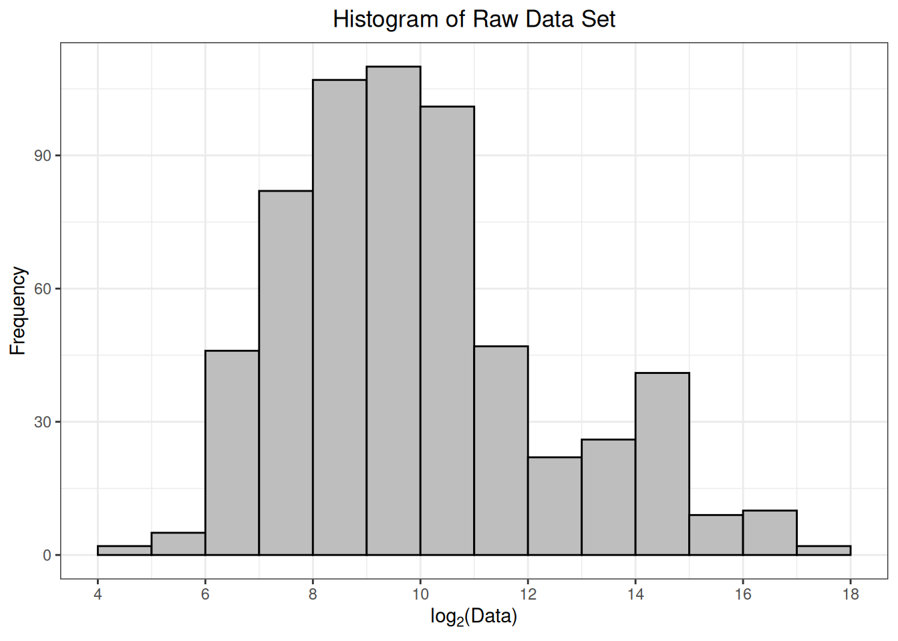
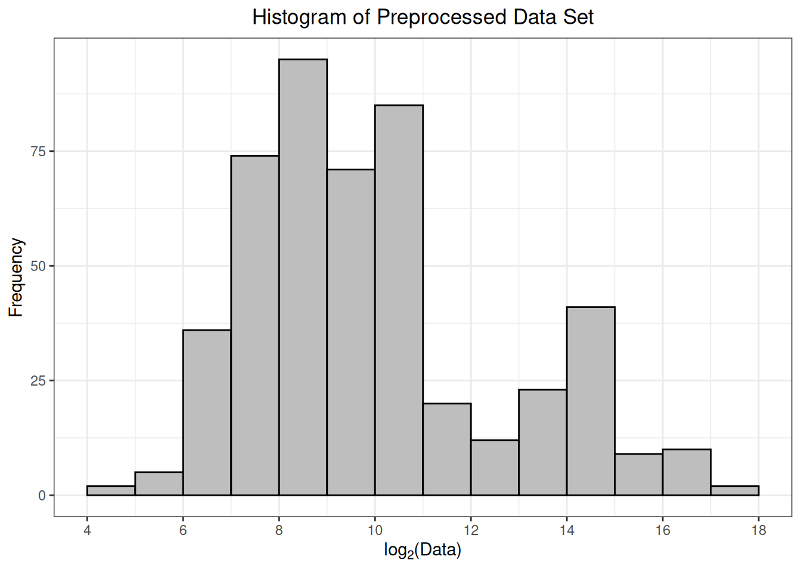

# Preprocessing

## Preliminary

``` r

## load R package
library(msDiaLogue)
```

## Example

``` r

## if the raw data is in a .csv file
fileName <- "../inst/extdata/Toy_Spectronaut_Data.csv"
dataSet <- preprocessing(fileName,
                         filterNaN = TRUE, filterUnique = 2,
                         replaceBlank = TRUE, saveRm = TRUE)
```

**Note:**
[`preprocessing()`](https://uconn-scs.github.io/msDiaLogue/reference/preprocessing.md)
does not perform a transformation on your data. You still need to use
the function
[`transform()`](https://uconn-scs.github.io/msDiaLogue/reference/transform.md).

``` r

## if the raw data is in an R data file
data("Toy_Spectronaut_Data")
dataSet <- preprocessing(dataSet = Toy_Spectronaut_Data,
                         filterNaN = TRUE, filterUnique = 2,
                         replaceBlank = TRUE, saveRm = TRUE)
#> Warning: Removed 62 rows containing non-finite outside the scale range
#> (`stat_bin()`).
```



    #> Summary of Preprocessed Data Signals:
    #>      Min.   1st Qu.    Median      Mean   3rd Qu.      Max.
    #>     23.19    266.76    694.02   6980.19   1869.80 132136.03



    #> Levels of Condition: 100fmol, 200fmol, 50fmol
    #> Levels of Replicate: 1, 2, 3, 4

| R.Condition | R.Replicate | NUD4B_HUMAN (+1) | A0A7P0T808_HUMAN (+1) | A0A8I5KU53_HUMAN (+1) | ZN840_HUMAN | CC85C_HUMAN | TMC5B_HUMAN | C9JEV0_HUMAN (+1) | C9JNU9_HUMAN | ALBU_BOVIN | CYC_BOVIN | TRFE_BOVIN | KRT16_MOUSE | F8W0H2_HUMAN | H0Y7V7_HUMAN (+1) | H0YD14_HUMAN | H3BUF6_HUMAN | H7C1W4_HUMAN (+1) | H7C3M7_HUMAN | TCPR2_HUMAN | TLR3_HUMAN | LRIG2_HUMAN | RAB3D_HUMAN | ADH1_YEAST | LYSC_CHICK | BGAL_ECOLI | CYTA_HUMAN | KPCB_HUMAN | LIPL_HUMAN | PIP_HUMAN | CO6_HUMAN | BGAL_HUMAN | SYTC_HUMAN | CASPE_HUMAN | DCAF6_HUMAN | DALD3_HUMAN | HGNAT_HUMAN | RFFL_HUMAN | RN185_HUMAN | ZN462_HUMAN | ALKB7_HUMAN | POLK_HUMAN | ACAD8_HUMAN | A0A7I2PK40_HUMAN (+2) | NBDY_HUMAN | H0Y5R1_HUMAN (+1) |
|:---|:---|:---|:---|:---|:---|:---|:---|:---|:---|:---|:---|:---|:---|:---|:---|:---|:---|:---|:---|:---|:---|:---|:---|:---|:---|:---|:---|:---|:---|:---|:---|:---|:---|:---|:---|:---|:---|:---|:---|:---|:---|:---|:---|:---|:---|:---|
| 100fmol | 1 | 1512.759 | 2997.02209 | 3371.4833 | 334.80388 | 407.0488 | 489.4850 | 203.37113 | 213.1143 | 108811.84 | 9690.868 | 14036.36 | 1690.365 | 532.3802 | 1332.0875 | 1141.9809 | 318.1188 | 312.56476 | 1120.9867 | 18002.6458 | 195.7776 | 560.3036 | 1322.602 | 29171.33 | 13713.424 | 23121.66 | 591.1640 | 924.0823 | 430.9869 | 116.59002 | 187.0816 | 4037.412 | 24017.74 | 105.22731 | 201.9954 | 1397.3715 | 1947.2304 | 194.66073 | 1102.9950 | 976.91724 | 207.1249 | 194.69980 | 244.13206 | NA | NA | NA |
| 100fmol | 2 | 1781.917 | 4357.08535 | 842.9818 | 447.03104 | 518.7363 | 467.7339 | 204.86459 | 305.2153 | 98828.47 | 10850.332 | 15621.79 | NA | 597.6368 | 1188.4426 | 1266.7351 | 280.9857 | 276.79778 | 1077.9421 | 1413.9067 | 239.0581 | 543.8075 | 1253.314 | 27879.27 | 13035.651 | 27456.12 | 602.9164 | 1340.9268 | 424.9000 | 125.78974 | 115.7475 | 3178.759 | 27438.09 | 151.58875 | 336.7029 | 969.5539 | 1502.3712 | 142.28964 | 1103.3769 | 374.15784 | 134.5607 | 709.19833 | 262.88982 | 1743.2662 | NA | NA |
| 100fmol | 3 | 1406.972 | 4786.48456 | 2194.8947 | 249.86449 | 555.3463 | NA | 116.38093 | 503.2769 | 101598.44 | 8684.345 | 16821.60 | NA | 660.5064 | 1059.7662 | 1014.8591 | 301.7436 | 231.29973 | 1554.0445 | 18365.4408 | 190.3686 | 295.6622 | 1314.844 | 32800.92 | 12066.374 | 24838.93 | 595.7836 | 1216.5285 | 288.4343 | NA | 115.2336 | 3701.760 | 25169.13 | 101.24499 | 307.3990 | 1114.7195 | 1208.7592 | 126.17845 | 1870.5048 | 412.57133 | 149.0596 | 182.37971 | 211.43579 | 1769.8376 | 1004.8916 | NA |
| 100fmol | 4 | 1681.397 | 3696.65961 | 1891.8054 | 376.06429 | 547.2002 | 471.5889 | 84.99050 | 360.8483 | 99355.87 | 11078.152 | 14676.16 | NA | 810.6129 | 1402.6763 | 1159.3741 | NA | 215.80109 | 800.7830 | 28578.1735 | 274.5684 | 407.2423 | 1257.433 | 25106.60 | 13296.061 | 20619.41 | 413.2262 | 1371.3643 | 349.6449 | NA | 141.2874 | 3938.512 | 24607.16 | 79.92251 | 257.4710 | 468.6696 | 1601.7529 | 88.33184 | 871.2289 | 371.60609 | 143.0994 | 162.21354 | 232.23867 | 1827.0492 | 854.4468 | 801.1353 |
| 200fmol | 1 | 1521.836 | 4371.54777 | 1854.1405 | 312.62524 | 148.6900 | 423.3701 | 131.02175 | NA | 132136.03 | 19328.703 | 18834.47 | 2069.912 | 516.2416 | 1178.3424 | 1043.8876 | 272.6046 | 295.79573 | 1441.5038 | 23523.2733 | 238.4131 | 310.2403 | 1009.710 | 46220.84 | 23180.376 | 41429.57 | 415.3739 | 1513.1556 | 450.0412 | 64.54044 | 126.7504 | 3417.982 | 26496.79 | 88.38325 | 204.2275 | 1006.4592 | 1869.7977 | 142.76032 | 364.4167 | 437.19794 | 241.2919 | 151.38894 | 425.84091 | 2437.8824 | NA | 806.9866 |
| 200fmol | 2 | 1593.643 | 4272.11244 | 2192.5291 | NA | 480.8571 | NA | 153.86154 | 275.4352 | 105138.41 | 18274.136 | 20674.32 | NA | 692.3428 | 1091.0855 | NA | 350.0098 | 295.56072 | 1132.2785 | 21674.8350 | 179.1959 | 437.1651 | 1309.207 | 49342.12 | 21816.062 | 50769.83 | 694.0213 | 1264.2230 | 467.7733 | NA | 145.1417 | 3499.032 | 29594.79 | 69.14327 | 266.7654 | 1166.2285 | 726.1907 | 128.65335 | 778.7439 | 407.71731 | 155.3213 | 167.11595 | 126.32254 | NA | 1181.7201 | 818.0170 |
| 200fmol | 3 | 1524.908 | 394.50764 | 1868.6211 | 363.74226 | 570.9065 | 453.6885 | 106.81184 | 493.8190 | 113944.78 | 16244.333 | 26795.97 | 1421.709 | 626.2046 | 1526.7599 | 1296.6478 | 285.6200 | 191.28838 | 1022.3743 | NA | 166.7045 | 550.3156 | 1031.190 | 48405.84 | 26937.736 | 45150.45 | 420.8589 | 980.0111 | 362.8388 | NA | 107.9112 | 3542.931 | 27621.70 | 63.17854 | 123.0147 | 1228.7033 | 1923.3727 | 114.71933 | 837.6604 | 544.64094 | 326.8218 | 137.55666 | 159.95827 | 1373.0632 | 759.5191 | 713.8570 |
| 200fmol | 4 | 1407.869 | 338.65408 | 2398.0057 | 389.27371 | 299.6378 | 548.4764 | 97.77212 | 339.9953 | 115019.73 | 19116.837 | 17007.87 | NA | 562.7719 | 873.4510 | 1332.6237 | 332.2913 | 98.89600 | 1086.8900 | NA | 157.5208 | NA | 1184.514 | 63282.06 | 22846.437 | 42463.09 | 547.4942 | 1155.4982 | 309.7372 | NA | 108.9164 | 4028.918 | 30701.37 | 56.35208 | 225.4517 | 879.8159 | 1775.5572 | 133.86373 | 599.5360 | 474.84833 | 207.8410 | 169.22639 | 411.30891 | 759.5981 | NA | NA |
| 50fmol | 1 | 1256.771 | 591.26441 | 182.6504 | 236.88844 | 348.6800 | NA | 712.79758 | 193.6435 | 131830.66 | 8234.339 | 11845.64 | NA | 580.8299 | 913.2487 | 1380.3400 | 282.0912 | 182.91250 | 606.2433 | 14136.0046 | 157.4161 | 333.7562 | 1201.025 | 17620.63 | 7750.717 | 16139.56 | 2818.1092 | 1211.6563 | 277.6940 | 881.86896 | 149.3065 | 4038.116 | 23017.99 | 776.14934 | 127.7249 | NA | 469.0506 | 90.06842 | 394.8413 | 47.02223 | 213.9390 | 23.19320 | 153.44947 | NA | NA | NA |
| 50fmol | 2 | 1472.071 | NA | 1435.5520 | 358.83284 | 347.4504 | NA | 247.81722 | 345.0750 | 116311.56 | 7605.903 | 12697.18 | NA | 551.2315 | 505.4586 | 971.2693 | 290.8165 | 125.83283 | 920.0514 | 27991.1799 | 145.7882 | 340.9205 | 1235.336 | 16001.37 | 7440.498 | 15811.83 | 760.7371 | NA | 394.0721 | 158.87202 | 177.9102 | 4501.100 | 24923.07 | 226.15373 | 153.1832 | 296.3736 | 1214.9322 | 110.78331 | 663.9165 | 486.90504 | 139.3999 | 86.68869 | 95.40880 | NA | NA | NA |
| 50fmol | 3 | 1556.050 | 40.66504 | 1565.3149 | 89.84338 | 298.6623 | 340.5793 | 258.46342 | 270.5502 | 104564.53 | 5484.956 | 12536.01 | 1238.106 | 557.1447 | NA | 1131.1380 | 257.8148 | 66.81291 | 773.9335 | 724.9454 | NA | NA | 1047.585 | 16408.15 | 6121.150 | 15935.57 | 1103.8303 | 1105.0807 | 318.7621 | 128.20868 | 103.7184 | 3742.431 | 25475.00 | 190.70466 | 115.1171 | 282.8682 | 857.0219 | 89.86919 | 484.3752 | 312.37532 | 312.5336 | 124.58086 | 65.88002 | NA | NA | NA |
| 50fmol | 4 | 1399.717 | 866.26279 | 1192.4345 | 290.70430 | 250.1042 | 371.8249 | 162.80005 | 377.9867 | 123775.12 | 6424.339 | 11443.28 | NA | NA | 631.6868 | 1251.5938 | 371.2717 | 27.73426 | 844.7931 | 16919.4242 | 157.2484 | 240.1422 | 1163.112 | 17304.55 | 6524.873 | 15485.40 | 816.2988 | 1260.9201 | NA | 164.75763 | NA | 3897.824 | 29814.45 | 231.85742 | 219.5657 | 540.5067 | 1000.0471 | 32.22857 | 515.4021 | 476.40258 | 181.6490 | 136.69320 | 131.36875 | NA | NA | NA |

## Details

The function
[`preprocessing()`](https://uconn-scs.github.io/msDiaLogue/reference/preprocessing.md)
takes a `.csv` file of summarized protein abundances, exported from
Spectronaut. The most important columns that need to be included in this
file are: `R.Condition`, `R.Replicate`, `PG.ProteinAccessions`,
`PG.ProteinNames`, `PG.NrOfStrippedSequencesIdentified`, and
`PG.Quantity`. This function will reformat the data and provide
functionality for some initial filtering (based on the number of unique
peptides). The steps below describe the operations performed during
preprocessing.

### 1. Loads the raw data

- If the raw data is in a `.csv` file
  [Toy_Spectronaut_Data.csv](https://github.com/uconn-scs/msDiaLogue/blob/main/inst/extdata/Toy_Spectronaut_Data.csv),
  specify the `fileName` to read the raw data file into R.

- If the raw data is stored in an R data file (e.g.,
  [Toy_Spectronaut_Data.rda](https://github.com/uconn-scs/msDiaLogue/blob/main/data/Toy_Spectronaut_Data.rda)
  or a `.RData` file), first load the data file directly, then specify
  the loaded object as the `dataSet` argument.

### 2. Filters out identified proteins that exhibit `NaN` quantitative values

`NaN`, which stands for “Not a Number,” can be found in the
`PG.Quantity` column for proteins that were identified by MS and MS/MS
evidence in the raw data, but all peptides from that protein lack an
associated integrated peak area or intensity. This usually occurs in low
abundance peptides that exhibit intensities close to the limit of
detection resulting in poor signal-to-noise (S/N) and/or when there is
interference from other co-eluting peptide ions with very similar or
identical m/z values that lead to difficulty in parsing out individual
intensity profiles.

### 3. Applies a unique peptides per protein filter

General practice in the proteomics field is to filter out proteins which
were identified on the basis of a single peptide. Because approximately
1% of all identified peptides are false positive matches, it’s more
likely that 1 peptide was incorrectly identified and that protein ID is
incorrect than that, for example, 5 peptides from the same protein were
all incorrectly identified and that protein ID is incorrect. We
recommend focusing on proteins with 2 or more peptide identifications,
as these will be higher confidence. If you have a protein of interest
with only 1 peptide identified, contact [PMF
faculty](https://proteomics.uconn.edu/about-us/) and we can help you
evaluate the evidence from the raw data to determine believability.

### 4. Adds accession numbers to identified proteins without informative names

Spectronaut reports contain 4 different columns of identifying
information:

- `PG.Genes`, which is the gene name (e.g. CDK1).
- `PG.ProteinAccessions`, which is the UniProt identifier number for a
  unique entry in the online database (e.g. P06493).
- `PG.ProteinDescriptions`, which is the protein name as provided on
  UniProt (e.g. cyclin-dependent kinase 1).
- `PG.ProteinNames`, which is a concatenation of an identifier and the
  species (e.g. CDK1_HUMAN).

Every entry in [UniProt](https://www.uniprot.org/) will have an
accession number, but may not have all of the other identifiers, due to
incomplete annotation. Because [UniProt](https://www.uniprot.org/)
includes entries for fragments of proteins and some proteins entries are
redundant, a peptide can match to multiple entries for the same protein,
which generates multiple possible identifiers in Spectronaut. Further,
the `ProteinNames` entry in Spectronaut can switch formats: the
preference is accession number and species, but can also be gene name
and species instead.

This option tells msDiaLogue to substitute the accession number for an
identifier if it tries to pull an identifier from a column with no
information.

**Note:** Not all proteins can be identified unambiguously. In many
cases, the identified peptides can be found in multiple protein
sequences, which yields a protein group or protein cluster rather than a
single protein identification. When this happens, the accession numbers
for all potential matches are concatenated into one string, separated by
periods. When you see long strings of multiple identifiers later in your
data processing, this is why. Spectronaut sorts these alphanumerically,
so you should not assume that the first protein in the list is most
likely to be correct (other search algorithms such as MaxQuant, which is
used in [PMF](https://proteomics.uconn.edu/) for most Scaffold-based
results, do rank protein cluster IDs by likelihood of correctness).

### 5. Saves a document to your working directory with all filtered out data, if desired

If `saveRm = TRUE`, the data removed in step 2
(`preprocess_filterNaN.csv`) and step 3 (`preprocess_filterUnique.csv`)
will be saved in the current working directory.

As part of the
[`preprocessing()`](https://uconn-scs.github.io/msDiaLogue/reference/preprocessing.md),
a histogram of \\log_2\\-transformed protein abundances is provided.
This is a helpful way to confirm that the data have been read in
correctly, and there are no issues with the numerical values of the
protein abundances. Ideally, this histogram will appear fairly
symmetrical (bell-shaped) without too much skew towards smaller or
larger values.

[Next
→](https://uconn-scs.github.io/msDiaLogue/articles/transformation.md)
