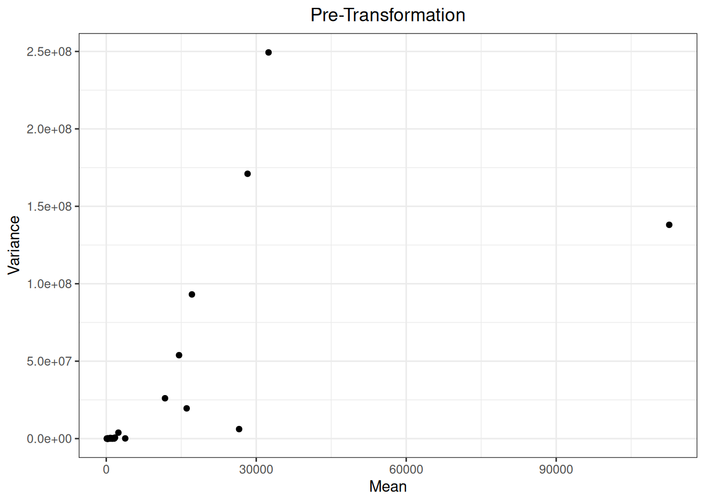
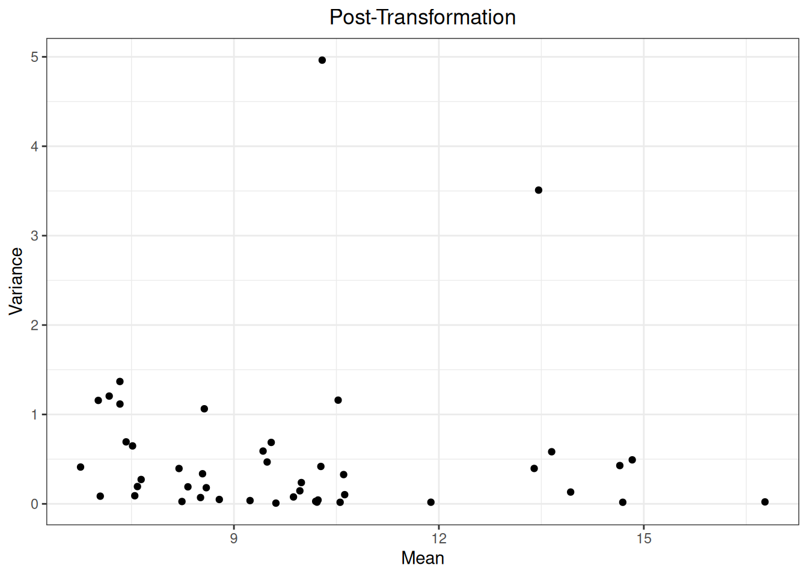

# Transformation

## Preliminary

``` r

## load R package
library(msDiaLogue)
## preprocessing
fileName <- "../inst/extdata/Toy_Spectronaut_Data.csv"
dataSet <- preprocessing(fileName,
                         filterNaN = TRUE, filterUnique = 2,
                         replaceBlank = TRUE, saveRm = TRUE)
```

## Example

``` r

dataTran <- transform(dataSet, logFold = 2)
```





| R.Condition | R.Replicate | NUD4B_HUMAN (+1) | A0A7P0T808_HUMAN (+1) | A0A8I5KU53_HUMAN (+1) | ZN840_HUMAN | CC85C_HUMAN | TMC5B_HUMAN | C9JEV0_HUMAN (+1) | C9JNU9_HUMAN | ALBU_BOVIN | CYC_BOVIN | TRFE_BOVIN | KRT16_MOUSE | F8W0H2_HUMAN | H0Y7V7_HUMAN (+1) | H0YD14_HUMAN | H3BUF6_HUMAN | H7C1W4_HUMAN (+1) | H7C3M7_HUMAN | TCPR2_HUMAN | TLR3_HUMAN | LRIG2_HUMAN | RAB3D_HUMAN | ADH1_YEAST | LYSC_CHICK | BGAL_ECOLI | CYTA_HUMAN | KPCB_HUMAN | LIPL_HUMAN | PIP_HUMAN | CO6_HUMAN | BGAL_HUMAN | SYTC_HUMAN | CASPE_HUMAN | DCAF6_HUMAN | DALD3_HUMAN | HGNAT_HUMAN | RFFL_HUMAN | RN185_HUMAN | ZN462_HUMAN | ALKB7_HUMAN | POLK_HUMAN | ACAD8_HUMAN | A0A7I2PK40_HUMAN (+2) | NBDY_HUMAN | H0Y5R1_HUMAN (+1) |
|:---|:---|---:|---:|---:|---:|---:|---:|---:|---:|---:|---:|---:|---:|---:|---:|---:|---:|---:|---:|---:|---:|---:|---:|---:|---:|---:|---:|---:|---:|---:|---:|---:|---:|---:|---:|---:|---:|---:|---:|---:|---:|---:|---:|---:|---:|---:|
| 100fmol | 1 | 10.56297 | 11.549314 | 11.719168 | 8.387172 | 8.669058 | 8.935121 | 7.667971 | 7.735483 | 16.73148 | 13.24241 | 13.77688 | 10.72312 | 9.056313 | 10.379473 | 10.157323 | 8.313422 | 8.288011 | 10.130553 | 14.135921 | 7.613072 | 9.130065 | 10.369163 | 14.83226 | 13.74330 | 14.49696 | 9.207415 | 9.851878 | 8.751500 | 6.865301 | 7.547524 | 11.97922 | 14.55181 | 6.717365 | 7.658178 | 10.448500 | 10.927208 | 7.604818 | 10.107211 | 9.932092 | 7.694357 | 7.605108 | 7.931518 | NA | NA | NA |
| 100fmol | 2 | 10.79921 | 12.089148 | 9.719358 | 8.804231 | 9.018858 | 8.869544 | 7.678527 | 8.253683 | 16.59264 | 13.40545 | 13.93127 | NA | 9.223125 | 10.214856 | 10.306899 | 8.134353 | 8.112689 | 10.074064 | 10.465471 | 7.901218 | 9.086952 | 10.291532 | 14.76691 | 13.67018 | 14.74484 | 9.235814 | 10.389015 | 8.730980 | 6.974870 | 6.854838 | 11.63425 | 14.74389 | 7.244019 | 8.395332 | 9.921177 | 10.553026 | 7.152687 | 10.107710 | 8.547503 | 7.072113 | 9.470045 | 8.038315 | 10.767577 | NA | NA |
| 100fmol | 3 | 10.45838 | 12.224751 | 11.099936 | 7.965002 | 9.117244 | NA | 6.862711 | 8.975209 | 16.63252 | 13.08420 | 14.03803 | NA | 9.367429 | 10.049530 | 9.987064 | 8.237180 | 7.853620 | 10.601812 | 14.164706 | 7.572652 | 8.207806 | 10.360676 | 15.00145 | 13.55870 | 14.60032 | 9.218644 | 10.248554 | 8.172099 | NA | 6.848418 | 11.85400 | 14.61937 | 6.661707 | 8.263969 | 10.122465 | 10.239311 | 6.979322 | 10.869212 | 8.688500 | 7.219746 | 7.510801 | 7.724076 | 10.789401 | 9.972824 | NA |
| 100fmol | 4 | 10.71544 | 11.852006 | 10.885548 | 8.554835 | 9.095925 | 8.881386 | 6.409230 | 8.495249 | 16.60032 | 13.43543 | 13.84119 | NA | 9.662869 | 10.453966 | 10.179130 | NA | 7.753558 | 9.645268 | 14.802626 | 8.101022 | 8.669744 | 10.296266 | 14.61578 | 13.69871 | 14.33172 | 8.690788 | 10.421396 | 8.449746 | NA | 7.142488 | 11.94343 | 14.58679 | 6.320530 | 8.008266 | 8.872427 | 10.645436 | 6.464862 | 9.766908 | 8.537630 | 7.160874 | 7.341750 | 7.859464 | 10.835300 | 9.738847 | 9.645902 |
| 200fmol | 1 | 10.57160 | 12.093929 | 10.856535 | 8.288291 | 7.216164 | 8.725776 | 7.033663 | NA | 17.01166 | 14.23846 | 14.20109 | 11.01535 | 9.011903 | 10.202543 | 10.027751 | 8.090666 | 8.208457 | 10.493359 | 14.521801 | 7.897320 | 8.277242 | 9.979726 | 15.49626 | 14.50062 | 15.33837 | 8.698267 | 10.563345 | 8.813913 | 6.012131 | 6.985846 | 11.73893 | 14.69353 | 6.465701 | 7.674034 | 9.975073 | 10.868666 | 7.157451 | 8.509445 | 8.772143 | 7.914636 | 7.242116 | 8.734171 | 11.251413 | NA | 9.656401 |
| 200fmol | 2 | 10.63811 | 12.060734 | 11.098380 | NA | 8.909464 | NA | 7.265489 | 8.105569 | 16.68193 | 14.15752 | 14.33555 | NA | 9.435343 | 10.091549 | NA | 8.451251 | 8.207311 | 10.145013 | 14.403733 | 7.485393 | 8.772034 | 10.354478 | 15.59053 | 14.41310 | 15.63168 | 9.438836 | 10.304035 | 8.869666 | NA | 7.181318 | 11.77274 | 14.85306 | 6.111517 | 8.059428 | 10.187635 | 9.504205 | 7.007345 | 9.605005 | 8.671425 | 7.279112 | 7.384706 | 6.980968 | NA | 10.206673 | 9.675987 |
| 200fmol | 3 | 10.57451 | 8.623909 | 10.867758 | 8.506773 | 9.157111 | 8.825558 | 6.738928 | 8.947838 | 16.79798 | 13.98765 | 14.70973 | 10.47341 | 9.290490 | 10.576258 | 10.340571 | 8.157953 | 7.579605 | 9.997708 | NA | 7.381150 | 9.104115 | 10.010094 | 15.56289 | 14.71734 | 15.46245 | 8.717193 | 9.936654 | 8.503185 | NA | 6.753701 | 11.79073 | 14.75351 | 5.981363 | 6.942687 | 10.262921 | 10.909423 | 6.841965 | 9.710222 | 9.089162 | 8.352360 | 7.103882 | 7.321552 | 10.423182 | 9.568943 | 9.479491 |
| 200fmol | 4 | 10.45930 | 8.403669 | 11.227619 | 8.604641 | 8.227076 | 9.099286 | 6.611351 | 8.409371 | 16.81152 | 14.22256 | 14.05391 | NA | 9.136406 | 9.770583 | 10.380054 | 8.376304 | 6.627840 | 10.085990 | NA | 7.299398 | NA | 10.210080 | 15.94951 | 14.47968 | 15.37392 | 9.096700 | 10.174299 | 8.274901 | NA | 6.767077 | 11.97618 | 14.90602 | 5.816397 | 7.816675 | 9.781058 | 10.794056 | 7.064621 | 9.227703 | 8.891323 | 7.699336 | 7.402811 | 8.684079 | 9.569093 | NA | NA |
| 50fmol | 1 | 10.29551 | 9.207660 | 7.512941 | 7.888064 | 8.445760 | NA | 9.477349 | 7.597259 | 17.00833 | 13.00744 | 13.53207 | NA | 9.181972 | 9.834864 | 10.430808 | 8.140018 | 7.515010 | 9.243753 | 13.787087 | 7.298440 | 8.382651 | 10.230051 | 14.10498 | 12.92011 | 13.97831 | 11.460512 | 10.242765 | 8.117352 | 9.784420 | 7.222133 | 11.97947 | 14.49047 | 9.600191 | 6.996896 | NA | 8.873600 | 6.492949 | 8.625129 | 5.555271 | 7.741055 | 4.535630 | 7.261620 | NA | NA | NA |
| 50fmol | 2 | 10.52363 | NA | 10.487390 | 8.487168 | 8.440663 | NA | 7.953133 | 8.430766 | 16.82764 | 12.89290 | 13.63222 | NA | 9.106515 | 8.981449 | 9.923728 | 8.183965 | 6.975365 | 9.845571 | 14.772685 | 7.187730 | 8.413291 | 10.270688 | 13.96591 | 12.86118 | 13.94872 | 9.571254 | NA | 8.622316 | 7.311721 | 7.475005 | 12.13606 | 14.60519 | 7.821160 | 7.259115 | 8.211273 | 10.246660 | 6.791597 | 9.374858 | 8.927497 | 7.123085 | 6.437772 | 6.576050 | NA | NA | NA |
| 50fmol | 3 | 10.60367 | 5.345717 | 10.612237 | 6.489340 | 8.222371 | 8.411847 | 8.013816 | 8.079752 | 16.67403 | 12.42126 | 13.61379 | 10.27392 | 9.121908 | NA | 10.143559 | 8.010191 | 6.062055 | 9.596066 | 9.501729 | NA | NA | 10.032851 | 14.00212 | 12.57959 | 13.95996 | 10.108303 | 10.109936 | 8.316336 | 7.002350 | 6.696528 | 11.86976 | 14.63679 | 7.575196 | 6.846958 | 8.143986 | 9.743188 | 6.489755 | 8.919981 | 8.287137 | 8.287868 | 6.960939 | 6.041769 | NA | NA | NA |
| 50fmol | 4 | 10.45092 | 9.758661 | 10.219694 | 8.183409 | 7.966386 | 8.538480 | 7.346957 | 8.562192 | 16.91736 | 12.64933 | 13.48221 | NA | NA | 9.303066 | 10.289551 | 8.536331 | 4.793597 | 9.722454 | 14.046393 | 7.296901 | 7.907745 | 10.183775 | 14.07886 | 12.67173 | 13.91862 | 9.672954 | 10.300261 | NA | 7.364202 | NA | 11.92845 | 14.86372 | 7.857094 | 7.778509 | 9.078169 | 9.965852 | 5.010268 | 9.009555 | 8.896037 | 7.505010 | 7.094798 | 7.037478 | NA | NA | NA |

## Details

Raw mass spectrometry intensity measurements are often unsuitable for
direct statistical modeling because the shape of the data is usually not
symmetrical and the variance is not consistent across the range of
intensities. Most proteomic workflows will convert these raw values with
a log\\\_2\\ transformation, which both reshapes the data into a more
symmetrical distribution, making it easier to interpret mean-based fold
changes, and also stabilizes the variance across the intensity range
(i.e. reduces heteroscedasticity).

[←
Previous](https://uconn-scs.github.io/msDiaLogue/articles/preprocessing.md)

[Next
→](https://uconn-scs.github.io/msDiaLogue/articles/filtering_annotation_based.md)
