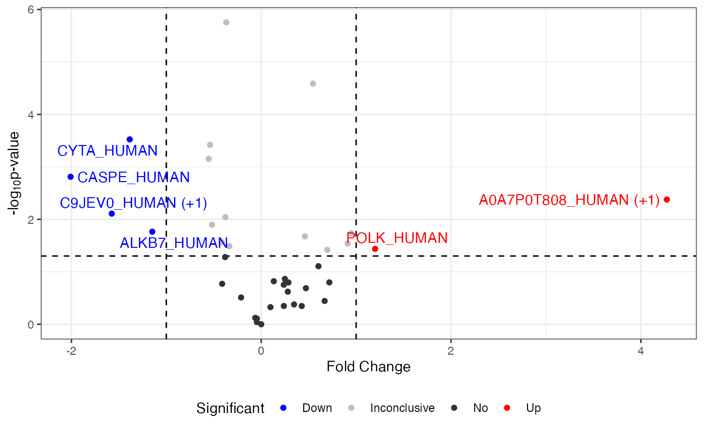
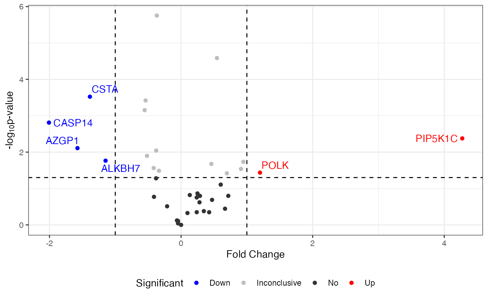
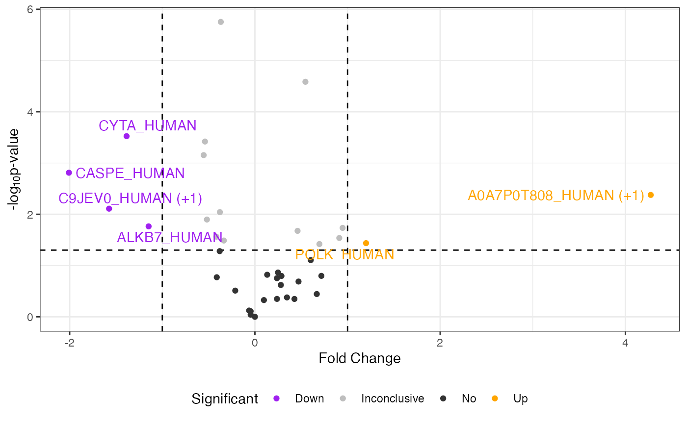
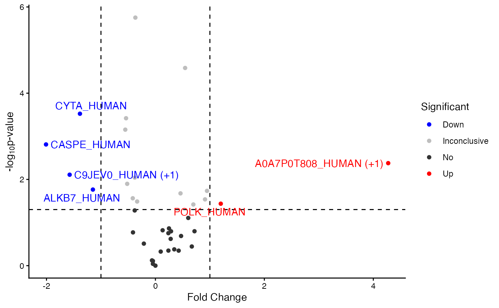
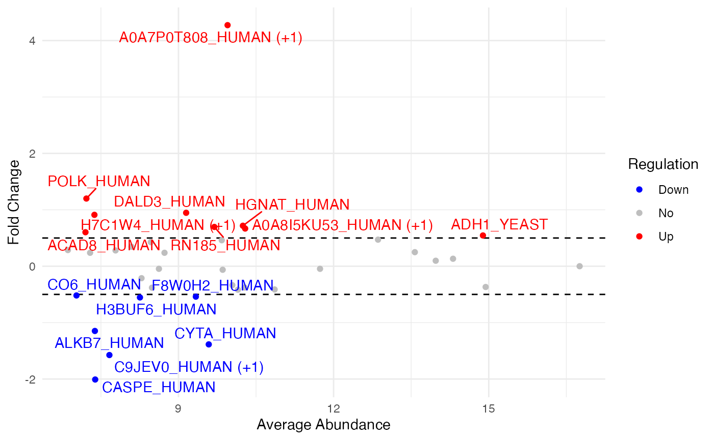

# Customizing msDiaLogue Visualizations

Many users have expressed a desire to customize msDiaLogue plots. To
address this, we will provide guidelines on how to modify ggplot objects
generated by msDiaLogue to align with the visual standards.

For R beginners, **R for Data Science** (Wickham et al. 2023) is a
fantastic resource, available online at <https://r4ds.hadley.nz/>. For
users particularly interested in data visualization, **ggplot2: Elegant
Graphics for Data Analysis** (Wickham 2016), available at
<https://ggplot2-book.org/>, is highly recommended.

The following is the preliminary to generate the default visualization
in msDiaLogue:

``` r

## load R package
library(msDiaLogue)
## preprocessing
fileName <- "../inst/extdata/Toy_Spectronaut_Data.csv"
dataSet <- preprocessing(fileName,
                         filterNaN = TRUE, filterUnique = 2,
                         replaceBlank = TRUE, saveRm = TRUE)
## transformation
dataTran <- transform(dataSet, logFold = 2)
## normalization
dataNorm <- normalize(dataTran, normalizeType = "quant")
## filtering
dataImput_pre <- filterNA(dataNorm, minProp = 0.51, by = "cond", saveRm = TRUE)
## imputation
dataImput <- impute.min_local(dataImput_pre)
## analysis
anlys_modt <- analyze.mod_t(dataImput, ref = "50pmol")
anlys_ma <- analyze.ma(dataImput, ref = "50pmol")
```

## Volcano plot

``` r

## default volcano
visualize.volcano(anlys_modt$`100pmol-50pmol`, P.thres = 0.05, F.thres = 1)
#> Warning: Removed 32 rows containing missing values or values outside the scale range
#> (`geom_text_repel()`).
```



### Change labels of proteins

The following code is shown to demonstrate how to replace the default
labels in the volcano plot with gene or protein names, using additional
information.

``` r

volcano <- visualize.volcano(anlys_modt$`100pmol-50pmol`,
                             P.thres = 0.05, F.thres = 1)

## change labels of proteins
library(dplyr)
volcano[["data"]] <- volcano[["data"]] %>%
  ## change the default labels from accessions to gene/protein names
  mutate(Label = ifelse(is.na(Label), Label, PG.Genes))

volcano
#> Warning: Removed 32 rows containing missing values or values outside the scale range
#> (`geom_text_repel()`).
```



### Change colors

To customize the colors in your volcano plot, you can use the function
[`ggplot_build()`](https://ggplot2.tidyverse.org/reference/ggplot_build.html)
from ggplot2. This allows you to specify custom colors for different
significance levels in the output plot.

``` r

volcano <- visualize.volcano(anlys_modt$`100pmol-50pmol`,
                             P.thres = 0.05, F.thres = 1)

library(ggplot2)
new <- ggplot_build(volcano)
new[["plot"]][["scales"]][["scales"]][[1]][["palette.cache"]] <-
  c(Down = "purple", Up = "orange", Inconclusive = "gray", No = "gray20")

new$plot
#> Warning: Removed 32 rows containing missing values or values outside the scale range
#> (`geom_text_repel()`).
```



### Change themes

To modify the appearance of your volcano plot, you can completely
override the current theme using ggplot2’s `theme_*()` functions. Themes
control the overall look of the plot, including the background,
gridlines, and text.

``` r

volcano <- visualize.volcano(anlys_modt$`100pmol-50pmol`,
                             P.thres = 0.05, F.thres = 1)

library(ggplot2)
## use a classic theme
volcano + theme_classic()
#> Warning: Removed 32 rows containing missing values or values outside the scale range
#> (`geom_text_repel()`).
```



## MA plot

``` r

## default MA
visualize.ma(anlys_ma$`100pmol-50pmol`, M.thres = 0.5)
#> Warning: Removed 22 rows containing missing values or values outside the scale range
#> (`geom_text_repel()`).
```


### Change labels of proteins

To change the labels on your plot from accession numbers to gene or
protein names, follow these steps:

``` r

ma <- visualize.ma(anlys_ma$`100pmol-50pmol`, M.thres = 0.5)

## change labels of proteins
library(dplyr)
ma[["data"]] <- ma[["data"]] %>%
  ## change the default labels from accessions to gene/protein names
  mutate(Label = ifelse(is.na(Label), Label, PG.Genes))

ma
#> Warning: Removed 22 rows containing missing values or values outside the scale range
#> (`geom_text_repel()`).
```


### Change colors

To adjust the colors in your MA plot, you can customize the color scheme
to better highlight different categories of significance. Here is how
you can modify the colors in the plot:

``` r

ma <- visualize.ma(anlys_ma$`100pmol-50pmol`, M.thres = 0.5)

library(ggplot2)
new <- ggplot_build(ma)
new[["plot"]][["scales"]][["scales"]][[1]][["palette.cache"]] <-
  c(Down = "darkblue", No = "gray", Up = "orange")

new$plot
#> Warning: Removed 22 rows containing missing values or values outside the scale range
#> (`geom_text_repel()`).
```


### Change themes

To alter the visual style of your MA plot, you can apply a different
theme using ggplot2’s theme functions.

``` r

ma <- visualize.ma(anlys_ma$`100pmol-50pmol`, M.thres = 0.5)

library(ggplot2)
 ## use a minimal theme
ma + theme_minimal()
#> Warning: Removed 22 rows containing missing values or values outside the scale range
#> (`geom_text_repel()`).
```



Wickham, Hadley. 2016. *ggplot2: Elegant Graphics for Data Analysis*.
Springer.

Wickham, Hadley, Mine Çetinkaya-Rundel, and Garrett Grolemund. 2023. *R
for Data Science*. O’Reilly Media.
