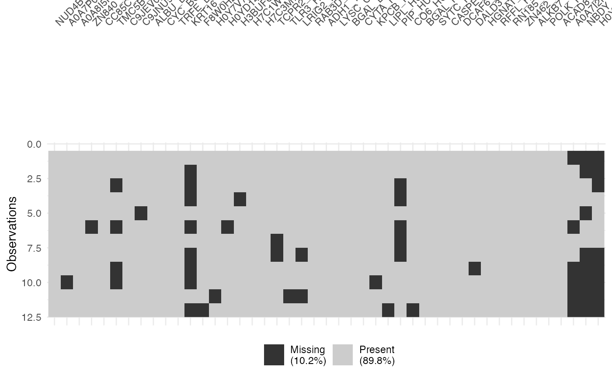

# Other Useful

## Preliminary

``` r

## load R package
library(msDiaLogue)
## preprocessing
fileName <- "../inst/extdata/Toy_Spectronaut_Data.csv"
dataSet <- preprocessing(fileName,
                         filterNaN = TRUE, filterUnique = 2,
                         replaceBlank = TRUE, saveRm = TRUE)
## transformation
dataTran <- transform(dataSet, logFold = 2)
## normalization
dataNorm <- normalize(dataTran, normalizeType = "quant")
## imputation
dataImput <- impute.min_local(dataNorm, reportImputing = FALSE,
                              reqPercentPresent = 0.51)
## filtering
dataImput <- filterNA(dataImput, saveRm = TRUE)
```

## dataMissing

Function
[`dataMissing()`](https://uconn-scs.github.io/msDiaLogue/reference/dataMissing.md)
is designed to summarize the missingness for each protein, where
`plot = TRUE` indicates plotting the missingness, and
`show_labels = TRUE` means that the protein names are displayed in the
printed plot. Note that the visual representation is not generated by
default, and the plot generation time varies with project size.

``` r

dataMissing <- dataMissing(dataNorm, plot = TRUE, show_labels = TRUE)
```



The percentage in the protein labels represents the proportion of
missing data in the samples for that protein. For instance, the label
“ZN840_HUMAN (8%)” indicates that, within all observations for the
protein “ZN840_HUMAN”, 8% of the data is missing. Additionally, the
percentage in the legend represents the proportion of missing data in
the whole dataset. In this case, 10.2% of the data in `dataNorm` is
missing.

Regardless of plot generation, the function
[`dataMissing()`](https://uconn-scs.github.io/msDiaLogue/reference/dataMissing.md)
always returns a table providing the following information:

- `count_miss`: The count of missing values for each protein.

- `pct_miss_col`: The percentage of missing values for each protein.

- `pct_miss_tot`: The percentage of missing values for each protein
  relative to the total missing values in the entire dataset.

|  | NUD4B_HUMAN (+1) | A0A7P0T808_HUMAN (+1) | A0A8I5KU53_HUMAN (+1) | ZN840_HUMAN | CC85C_HUMAN | TMC5B_HUMAN | C9JEV0_HUMAN (+1) | C9JNU9_HUMAN | ALBU_BOVIN | CYC_BOVIN | TRFE_BOVIN | KRT16_MOUSE | F8W0H2_HUMAN | H0Y7V7_HUMAN (+1) | H0YD14_HUMAN | H3BUF6_HUMAN | H7C1W4_HUMAN (+1) | H7C3M7_HUMAN | TCPR2_HUMAN | TLR3_HUMAN | LRIG2_HUMAN | RAB3D_HUMAN | ADH1_YEAST | LYSC_CHICK | BGAL_ECOLI | CYTA_HUMAN | KPCB_HUMAN | LIPL_HUMAN | PIP_HUMAN | CO6_HUMAN | BGAL_HUMAN | SYTC_HUMAN | CASPE_HUMAN | DCAF6_HUMAN | DALD3_HUMAN | HGNAT_HUMAN | RFFL_HUMAN | RN185_HUMAN | ZN462_HUMAN | ALKB7_HUMAN | POLK_HUMAN | ACAD8_HUMAN | A0A7I2PK40_HUMAN (+2) | NBDY_HUMAN | H0Y5R1_HUMAN (+1) |
|:---|---:|---:|---:|---:|---:|---:|---:|---:|---:|---:|---:|---:|---:|---:|---:|---:|---:|---:|---:|---:|---:|---:|---:|---:|---:|---:|---:|---:|---:|---:|---:|---:|---:|---:|---:|---:|---:|---:|---:|---:|---:|---:|---:|---:|---:|
| count_miss | 0 | 1.000000 | 0 | 1.000000 | 0 | 4.000000 | 0 | 1.000000 | 0 | 0 | 0 | 8.00000 | 1.000000 | 1.000000 | 1.000000 | 1.000000 | 0 | 0 | 2.000000 | 1.000000 | 2.000000 | 0 | 0 | 0 | 0 | 0 | 1.000000 | 1.000000 | 5.000000 | 1.000000 | 0 | 0 | 0 | 0 | 1.000000 | 0 | 0 | 0 | 0 | 0 | 0 | 0 | 6.00000 | 8.00000 | 8.00000 |
| pct_miss_col | 0 | 8.333333 | 0 | 8.333333 | 0 | 33.333333 | 0 | 8.333333 | 0 | 0 | 0 | 66.66667 | 8.333333 | 8.333333 | 8.333333 | 8.333333 | 0 | 0 | 16.666667 | 8.333333 | 16.666667 | 0 | 0 | 0 | 0 | 0 | 8.333333 | 8.333333 | 41.666667 | 8.333333 | 0 | 0 | 0 | 0 | 8.333333 | 0 | 0 | 0 | 0 | 0 | 0 | 0 | 50.00000 | 66.66667 | 66.66667 |
| pct_miss_tot | 0 | 1.818182 | 0 | 1.818182 | 0 | 7.272727 | 0 | 1.818182 | 0 | 0 | 0 | 14.54545 | 1.818182 | 1.818182 | 1.818182 | 1.818182 | 0 | 0 | 3.636364 | 1.818182 | 3.636364 | 0 | 0 | 0 | 0 | 0 | 1.818182 | 1.818182 | 9.090909 | 1.818182 | 0 | 0 | 0 | 0 | 1.818182 | 0 | 0 | 0 | 0 | 0 | 0 | 0 | 10.90909 | 14.54545 | 14.54545 |

For example, in the case of the protein “ZN840_HUMAN,” there are 1 NA
values in the samples, representing 8.33% of the missing data for
“ZN840_HUMAN” within that sample and 1.82% of the total missing data in
the entire dataset.

## pullProteinPath

The function
[`pullProteinPath()`](https://uconn-scs.github.io/msDiaLogue/reference/pullProteinPath.md)
allows you to see the quantitative values associated with specific
proteins at each step of processing, using either the exact match
argument `listname =`, or the text match argument `regexName =`, or
both.

This can be useful for questions such as,

- “Which of the values for my favorite protein were actually measured,
  vs. imputed?”
- “Why didn’t my favorite protein make it to the final list? At what
  step was it filtered out?”.

It can also be used to check whether the fold-change observed for a
specific protein is an artifact from one of the processing steps.

``` r

Check <- pullProteinPath(
  listName = c("LYSC_CHICK", "BGAL_ECOLI"),
  regexName = c("BOVIN"),
  by = "PG.ProteinNames",
  dataSetList = list(Initial = dataSet,
                     Transformed = dataTran,
                     Normalized = dataNorm,
                     Imputed = dataImput))
```

| PG.ProteinNames | PG.Genes | PG.ProteinAccession | PG.ProteinAccessions | PG.ProteinDescriptions | PG.ProteinName | R.Condition | R.Replicate | Initial | Transformed | Normalized | Imputed |
|:---|:---|:---|:---|:---|:---|:---|:---|---:|---:|---:|---:|
| ALBU_BOVIN | ALB | CON\_\_P02769 | CON\_\_P02769 | Bovine serum albumin | ALBU_BOVIN | 100pmol | 1 | 111209.703 | 16.76292 | 16.75777 | 16.75777 |
| ALBU_BOVIN | ALB | CON\_\_P02769 | CON\_\_P02769 | Bovine serum albumin | ALBU_BOVIN | 100pmol | 2 | 111659.883 | 16.76875 | 16.75777 | 16.75777 |
| ALBU_BOVIN | ALB | CON\_\_P02769 | CON\_\_P02769 | Bovine serum albumin | ALBU_BOVIN | 100pmol | 3 | 105982.914 | 16.69347 | 16.75777 | 16.75777 |
| ALBU_BOVIN | ALB | CON\_\_P02769 | CON\_\_P02769 | Bovine serum albumin | ALBU_BOVIN | 100pmol | 4 | 104442.562 | 16.67235 | 16.75777 | 16.75777 |
| ALBU_BOVIN | ALB | CON\_\_P02769 | CON\_\_P02769 | Bovine serum albumin | ALBU_BOVIN | 200pmol | 1 | 109245.289 | 16.73721 | 16.75777 | 16.75777 |
| ALBU_BOVIN | ALB | CON\_\_P02769 | CON\_\_P02769 | Bovine serum albumin | ALBU_BOVIN | 200pmol | 2 | 113357.508 | 16.79052 | 16.75777 | 16.75777 |
| ALBU_BOVIN | ALB | CON\_\_P02769 | CON\_\_P02769 | Bovine serum albumin | ALBU_BOVIN | 200pmol | 3 | 114321.836 | 16.80274 | 16.75777 | 16.75777 |
| ALBU_BOVIN | ALB | CON\_\_P02769 | CON\_\_P02769 | Bovine serum albumin | ALBU_BOVIN | 200pmol | 4 | 116439.820 | 16.82923 | 16.75777 | 16.75777 |
| ALBU_BOVIN | ALB | CON\_\_P02769 | CON\_\_P02769 | Bovine serum albumin | ALBU_BOVIN | 50pmol | 1 | 117803.492 | 16.84602 | 16.75777 | 16.75777 |
| ALBU_BOVIN | ALB | CON\_\_P02769 | CON\_\_P02769 | Bovine serum albumin | ALBU_BOVIN | 50pmol | 2 | 110086.680 | 16.74828 | 16.75777 | 16.75777 |
| ALBU_BOVIN | ALB | CON\_\_P02769 | CON\_\_P02769 | Bovine serum albumin | ALBU_BOVIN | 50pmol | 3 | 105640.203 | 16.68880 | 16.75777 | 16.75777 |
| ALBU_BOVIN | ALB | CON\_\_P02769 | CON\_\_P02769 | Bovine serum albumin | ALBU_BOVIN | 50pmol | 4 | 110446.000 | 16.75298 | 16.75777 | 16.75777 |
| BGAL_ECOLI | lacZ | P00722 | P00722 | Beta-galactosidase | BGAL_ECOLI | 100pmol | 1 | 23840.031 | 14.54110 | 14.44005 | 14.44005 |
| BGAL_ECOLI | lacZ | P00722 | P00722 | Beta-galactosidase | BGAL_ECOLI | 100pmol | 2 | 23963.307 | 14.54854 | 14.44005 | 14.44005 |
| BGAL_ECOLI | lacZ | P00722 | P00722 | Beta-galactosidase | BGAL_ECOLI | 100pmol | 3 | 22957.350 | 14.48667 | 14.42169 | 14.42169 |
| BGAL_ECOLI | lacZ | P00722 | P00722 | Beta-galactosidase | BGAL_ECOLI | 100pmol | 4 | 22311.297 | 14.44549 | 14.20112 | 14.20112 |
| BGAL_ECOLI | lacZ | P00722 | P00722 | Beta-galactosidase | BGAL_ECOLI | 200pmol | 1 | 41234.672 | 15.33157 | 14.77650 | 14.77650 |
| BGAL_ECOLI | lacZ | P00722 | P00722 | Beta-galactosidase | BGAL_ECOLI | 200pmol | 2 | 42899.434 | 15.38867 | 14.70670 | 14.70670 |
| BGAL_ECOLI | lacZ | P00722 | P00722 | Beta-galactosidase | BGAL_ECOLI | 200pmol | 3 | 42904.945 | 15.38886 | 14.77650 | 14.77650 |
| BGAL_ECOLI | lacZ | P00722 | P00722 | Beta-galactosidase | BGAL_ECOLI | 200pmol | 4 | 43279.844 | 15.40141 | 14.70670 | 14.70670 |
| BGAL_ECOLI | lacZ | P00722 | P00722 | Beta-galactosidase | BGAL_ECOLI | 50pmol | 1 | 14728.673 | 13.84634 | 14.38206 | 14.38206 |
| BGAL_ECOLI | lacZ | P00722 | P00722 | Beta-galactosidase | BGAL_ECOLI | 50pmol | 2 | 14736.710 | 13.84713 | 14.10465 | 14.10465 |
| BGAL_ECOLI | lacZ | P00722 | P00722 | Beta-galactosidase | BGAL_ECOLI | 50pmol | 3 | 14160.203 | 13.78955 | 14.38206 | 14.38206 |
| BGAL_ECOLI | lacZ | P00722 | P00722 | Beta-galactosidase | BGAL_ECOLI | 50pmol | 4 | 14758.731 | 13.84928 | 14.10465 | 14.10465 |
| CYC_BOVIN | CYCS | CON\_\_P62894 | CON\_\_P62894 | Cytochrome c | CYC_BOVIN | 100pmol | 1 | 10737.953 | 13.39043 | 12.96499 | 12.96499 |
| CYC_BOVIN | CYCS | CON\_\_P62894 | CON\_\_P62894 | Cytochrome c | CYC_BOVIN | 100pmol | 2 | 10655.384 | 13.37929 | 13.62766 | 13.62766 |
| CYC_BOVIN | CYCS | CON\_\_P62894 | CON\_\_P62894 | Cytochrome c | CYC_BOVIN | 100pmol | 3 | 10663.714 | 13.38042 | 12.81909 | 12.81909 |
| CYC_BOVIN | CYCS | CON\_\_P62894 | CON\_\_P62894 | Cytochrome c | CYC_BOVIN | 100pmol | 4 | 10843.115 | 13.40449 | 12.96499 | 12.96499 |
| CYC_BOVIN | CYCS | CON\_\_P62894 | CON\_\_P62894 | Cytochrome c | CYC_BOVIN | 200pmol | 1 | 19524.863 | 14.25302 | 13.10393 | 13.10393 |
| CYC_BOVIN | CYCS | CON\_\_P62894 | CON\_\_P62894 | Cytochrome c | CYC_BOVIN | 200pmol | 2 | 20072.297 | 14.29292 | 12.49496 | 12.49496 |
| CYC_BOVIN | CYCS | CON\_\_P62894 | CON\_\_P62894 | Cytochrome c | CYC_BOVIN | 200pmol | 3 | 20787.127 | 14.34340 | 14.00189 | 14.00189 |
| CYC_BOVIN | CYCS | CON\_\_P62894 | CON\_\_P62894 | Cytochrome c | CYC_BOVIN | 200pmol | 4 | 19924.240 | 14.28224 | 13.38772 | 13.38772 |
| CYC_BOVIN | CYCS | CON\_\_P62894 | CON\_\_P62894 | Cytochrome c | CYC_BOVIN | 50pmol | 1 | 6758.298 | 12.72244 | 12.49496 | 12.49496 |
| CYC_BOVIN | CYCS | CON\_\_P62894 | CON\_\_P62894 | Cytochrome c | CYC_BOVIN | 50pmol | 2 | 6721.135 | 12.71449 | 12.30540 | 12.30540 |
| CYC_BOVIN | CYCS | CON\_\_P62894 | CON\_\_P62894 | Cytochrome c | CYC_BOVIN | 50pmol | 3 | 6172.877 | 12.59173 | 13.38772 | 13.38772 |
| CYC_BOVIN | CYCS | CON\_\_P62894 | CON\_\_P62894 | Cytochrome c | CYC_BOVIN | 50pmol | 4 | 6028.398 | 12.55756 | 12.30540 | 12.30540 |
| LYSC_CHICK | LYZ | P00698 | P00698 | Lysozyme C | LYSC_CHICK | 100pmol | 1 | 13798.590 | 13.75223 | 13.62766 | 13.62766 |
| LYSC_CHICK | LYZ | P00698 | P00698 | Lysozyme C | LYSC_CHICK | 100pmol | 2 | 13880.411 | 13.76076 | 13.97388 | 13.97388 |
| LYSC_CHICK | LYZ | P00698 | P00698 | Lysozyme C | LYSC_CHICK | 100pmol | 3 | 13723.719 | 13.74438 | 13.55168 | 13.55168 |
| LYSC_CHICK | LYZ | P00698 | P00698 | Lysozyme C | LYSC_CHICK | 100pmol | 4 | 13944.603 | 13.76742 | 13.62766 | 13.62766 |
| LYSC_CHICK | LYZ | P00698 | P00698 | Lysozyme C | LYSC_CHICK | 200pmol | 1 | 24344.188 | 14.57129 | 14.22236 | 14.22236 |
| LYSC_CHICK | LYZ | P00698 | P00698 | Lysozyme C | LYSC_CHICK | 200pmol | 2 | 24742.227 | 14.59469 | 13.88102 | 13.88102 |
| LYSC_CHICK | LYZ | P00698 | P00698 | Lysozyme C | LYSC_CHICK | 200pmol | 3 | 24803.633 | 14.59826 | 14.22236 | 14.22236 |
| LYSC_CHICK | LYZ | P00698 | P00698 | Lysozyme C | LYSC_CHICK | 200pmol | 4 | 26381.047 | 14.68721 | 14.13067 | 14.13067 |
| LYSC_CHICK | LYZ | P00698 | P00698 | Lysozyme C | LYSC_CHICK | 50pmol | 1 | 7169.955 | 12.80775 | 13.38772 | 13.38772 |
| LYSC_CHICK | LYZ | P00698 | P00698 | Lysozyme C | LYSC_CHICK | 50pmol | 2 | 7797.536 | 12.92880 | 13.25790 | 13.25790 |
| LYSC_CHICK | LYZ | P00698 | P00698 | Lysozyme C | LYSC_CHICK | 50pmol | 3 | 7432.793 | 12.85969 | 13.88102 | 13.88102 |
| LYSC_CHICK | LYZ | P00698 | P00698 | Lysozyme C | LYSC_CHICK | 50pmol | 4 | 7543.633 | 12.88104 | 13.25790 | 13.25790 |
| TRFE_BOVIN | TF | CON\_\_Q0IIK2 | CON\_\_Q0IIK2 | Serotransferrin (UP merge to Q29443) | TRFE_BOVIN | 100pmol | 1 | 15097.670 | 13.88204 | 13.97388 | 13.97388 |
| TRFE_BOVIN | TF | CON\_\_Q0IIK2 | CON\_\_Q0IIK2 | Serotransferrin (UP merge to Q29443) | TRFE_BOVIN | 100pmol | 2 | 15840.281 | 13.95131 | 14.20112 | 14.20112 |
| TRFE_BOVIN | TF | CON\_\_Q0IIK2 | CON\_\_Q0IIK2 | Serotransferrin (UP merge to Q29443) | TRFE_BOVIN | 100pmol | 3 | 15022.215 | 13.87481 | 13.94448 | 13.94448 |
| TRFE_BOVIN | TF | CON\_\_Q0IIK2 | CON\_\_Q0IIK2 | Serotransferrin (UP merge to Q29443) | TRFE_BOVIN | 100pmol | 4 | 15160.493 | 13.88803 | 13.97388 | 13.97388 |
| TRFE_BOVIN | TF | CON\_\_Q0IIK2 | CON\_\_Q0IIK2 | Serotransferrin (UP merge to Q29443) | TRFE_BOVIN | 200pmol | 1 | 21577.973 | 14.39727 | 14.00189 | 14.00189 |
| TRFE_BOVIN | TF | CON\_\_Q0IIK2 | CON\_\_Q0IIK2 | Serotransferrin (UP merge to Q29443) | TRFE_BOVIN | 200pmol | 2 | 22968.959 | 14.48740 | 13.38772 | 13.38772 |
| TRFE_BOVIN | TF | CON\_\_Q0IIK2 | CON\_\_Q0IIK2 | Serotransferrin (UP merge to Q29443) | TRFE_BOVIN | 200pmol | 3 | 20720.127 | 14.33875 | 13.70002 | 13.70002 |
| TRFE_BOVIN | TF | CON\_\_Q0IIK2 | CON\_\_Q0IIK2 | Serotransferrin (UP merge to Q29443) | TRFE_BOVIN | 200pmol | 4 | 22153.398 | 14.43524 | 13.88102 | 13.88102 |
| TRFE_BOVIN | TF | CON\_\_Q0IIK2 | CON\_\_Q0IIK2 | Serotransferrin (UP merge to Q29443) | TRFE_BOVIN | 50pmol | 1 | 12183.812 | 13.57268 | 13.88102 | 13.88102 |
| TRFE_BOVIN | TF | CON\_\_Q0IIK2 | CON\_\_Q0IIK2 | Serotransferrin (UP merge to Q29443) | TRFE_BOVIN | 50pmol | 2 | 12521.783 | 13.61215 | 13.84672 | 13.84672 |
| TRFE_BOVIN | TF | CON\_\_Q0IIK2 | CON\_\_Q0IIK2 | Serotransferrin (UP merge to Q29443) | TRFE_BOVIN | 50pmol | 3 | 11926.220 | 13.54185 | 14.13067 | 14.13067 |
| TRFE_BOVIN | TF | CON\_\_Q0IIK2 | CON\_\_Q0IIK2 | Serotransferrin (UP merge to Q29443) | TRFE_BOVIN | 50pmol | 4 | 12021.495 | 13.55333 | 13.84672 | 13.84672 |

## trimFASTA

[←
Previous](https://uconn-scs.github.io/msDiaLogue/articles/visualization.md)
