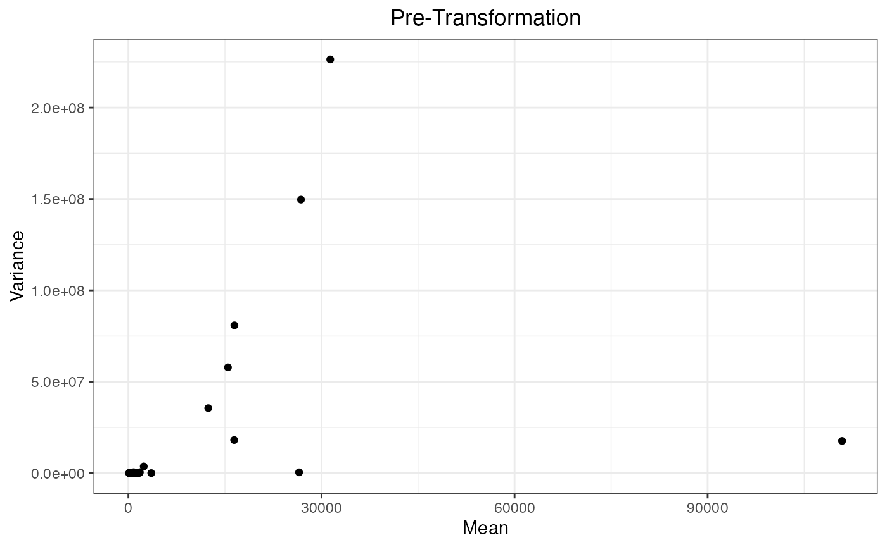
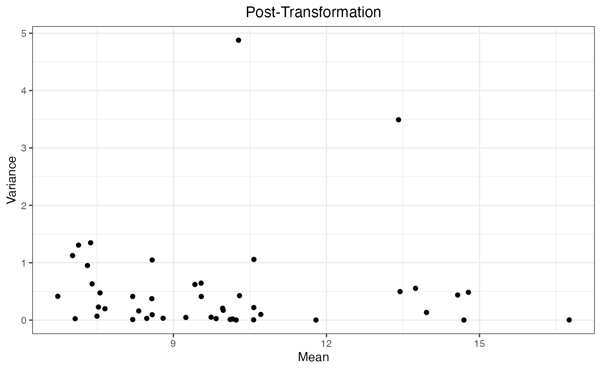

# Transformation

## Preliminary

``` r

## load R package
library(msDiaLogue)
## preprocessing
fileName <- "../inst/extdata/Toy_Spectronaut_Data.csv"
dataSet <- preprocessing(fileName,
                         filterNaN = TRUE, filterUnique = 2,
                         replaceBlank = TRUE, saveRm = TRUE)
```

## Example

``` r

dataTran <- transform(dataSet, logFold = 2)
```



| R.Condition | R.Replicate | NUD4B_HUMAN (+1) | A0A7P0T808_HUMAN (+1) | A0A8I5KU53_HUMAN (+1) | ZN840_HUMAN | CC85C_HUMAN | TMC5B_HUMAN | C9JEV0_HUMAN (+1) | C9JNU9_HUMAN | ALBU_BOVIN | CYC_BOVIN | TRFE_BOVIN | KRT16_MOUSE | F8W0H2_HUMAN | H0Y7V7_HUMAN (+1) | H0YD14_HUMAN | H3BUF6_HUMAN | H7C1W4_HUMAN (+1) | H7C3M7_HUMAN | TCPR2_HUMAN | TLR3_HUMAN | LRIG2_HUMAN | RAB3D_HUMAN | ADH1_YEAST | LYSC_CHICK | BGAL_ECOLI | CYTA_HUMAN | KPCB_HUMAN | LIPL_HUMAN | PIP_HUMAN | CO6_HUMAN | BGAL_HUMAN | SYTC_HUMAN | CASPE_HUMAN | DCAF6_HUMAN | DALD3_HUMAN | HGNAT_HUMAN | RFFL_HUMAN | RN185_HUMAN | ZN462_HUMAN | ALKB7_HUMAN | POLK_HUMAN | ACAD8_HUMAN | A0A7I2PK40_HUMAN (+2) | NBDY_HUMAN | H0Y5R1_HUMAN (+1) |
|:---|:---|---:|---:|---:|---:|---:|---:|---:|---:|---:|---:|---:|---:|---:|---:|---:|---:|---:|---:|---:|---:|---:|---:|---:|---:|---:|---:|---:|---:|---:|---:|---:|---:|---:|---:|---:|---:|---:|---:|---:|---:|---:|---:|---:|---:|---:|
| 100pmol | 1 | 10.59617 | 11.629505 | 11.461371 | 8.315348 | 8.952781 | 8.833937 | 7.736180 | 7.889538 | 16.76292 | 13.39043 | 13.88204 | 10.81329 | 9.299651 | 10.357346 | 10.321521 | 8.132535 | 8.226486 | 10.173123 | 14.006782 | 7.486384 | 9.011536 | 10.26981 | 14.75235 | 13.75223 | 14.54110 | 9.262305 | 9.952103 | 8.781496 | 7.047859 | 7.234610 | 11.80494 | 14.71384 | 6.775489 | 7.725502 | 10.335975 | 10.939236 | 7.568272 | 10.111329 | 9.938277 | 7.496910 | 7.637679 | 7.712738 | NA | NA | NA |
| 100pmol | 2 | 10.71487 | 12.159989 | 10.052500 | 8.659134 | 9.121174 | 8.968803 | 7.530568 | 8.294768 | 16.76875 | 13.37929 | 13.95131 | NA | 9.167541 | 10.121893 | 10.338709 | 8.086487 | 7.954448 | 10.011280 | 10.512493 | 7.735480 | 8.943620 | 10.21241 | 14.73246 | 13.76076 | 14.54854 | 9.322413 | 10.073449 | 8.509870 | 7.008875 | 7.002919 | 11.73674 | 14.70683 | 7.279609 | 8.445472 | 10.058467 | 10.559522 | 7.265925 | 10.348343 | 8.602358 | 6.939530 | 9.553050 | 7.950604 | 10.471813 | NA | NA |
| 100pmol | 3 | 10.46639 | 12.190792 | 11.088689 | 8.103769 | 9.127531 | NA | 6.797573 | 8.969260 | 16.69347 | 13.38042 | 13.87481 | NA | 9.260677 | 10.257840 | 9.885818 | 8.275007 | 8.080432 | 10.820332 | 14.395759 | 7.649245 | 8.418693 | 10.26143 | 14.69847 | 13.74438 | 14.48667 | 9.107695 | 10.200628 | 8.317577 | NA | 6.888870 | 11.77277 | 14.67310 | 6.520759 | 8.318009 | 9.970591 | 10.390675 | 7.161124 | 10.401629 | 8.748640 | 7.176720 | 7.418964 | 7.793871 | 10.883458 | 9.706811 | NA |
| 100pmol | 4 | 10.66221 | 11.902450 | 11.010415 | 8.588923 | 9.124371 | 8.721258 | 6.397005 | 8.386462 | 16.67235 | 13.40449 | 13.88803 | NA | 9.792043 | 10.165829 | 10.092467 | NA | 7.841731 | 9.816296 | 14.485405 | 7.911680 | 8.707996 | 10.21790 | 14.67556 | 13.76742 | 14.44549 | 8.776573 | 10.183221 | 8.457541 | NA | 7.107332 | 11.76563 | 14.66124 | 6.463718 | 7.766514 | 8.936074 | 10.749752 | 6.643218 | 9.952253 | 8.620437 | 7.071718 | 7.181633 | 7.757381 | 10.653061 | 9.892252 | 9.835011 |
| 200pmol | 1 | 10.56298 | 12.047141 | 10.969287 | 8.402065 | 7.288615 | 8.509940 | 7.197741 | NA | 16.73721 | 14.25302 | 14.39727 | 11.11126 | 8.941866 | 10.283605 | 10.077367 | 8.077610 | 7.977841 | 10.506136 | 14.365875 | 7.806321 | 8.293637 | 10.20088 | 15.57144 | 14.57129 | 15.33157 | 8.510688 | 10.232523 | 8.590645 | 6.031341 | 7.239260 | 11.79502 | 14.68066 | 6.343792 | 7.535170 | 9.876348 | 11.069962 | 7.034874 | 8.573870 | 8.746924 | 7.903880 | 7.180345 | 8.730611 | 11.190966 | NA | 9.710589 |
| 200pmol | 2 | 10.53186 | 11.771837 | 11.088757 | NA | 9.104358 | NA | 7.085164 | 8.208757 | 16.79052 | 14.29292 | 14.48740 | NA | 9.387564 | 10.060966 | NA | 8.157292 | 8.019591 | 10.035834 | 14.652848 | 7.572173 | 8.822824 | 10.25298 | 15.60578 | 14.59469 | 15.38867 | 9.307350 | 10.269781 | 8.693930 | NA | 7.085982 | 11.84818 | 14.75441 | 6.120292 | 7.968111 | 9.994960 | 9.503153 | 6.860543 | 9.776460 | 8.775531 | 7.059936 | 7.330260 | 7.277041 | NA | 10.041446 | 9.966576 |
| 200pmol | 3 | 10.60347 | 8.477484 | 11.155251 | 8.568416 | 9.140283 | 8.954421 | 6.690756 | 8.888482 | 16.80274 | 14.34340 | 14.33875 | 10.50303 | 9.196543 | 10.428428 | 10.222608 | 8.188220 | 7.525047 | 10.134101 | NA | 7.447663 | 8.755449 | 10.24829 | 15.62983 | 14.59826 | 15.38886 | 8.802237 | 10.080459 | 8.482341 | NA | 7.011984 | 11.78574 | 14.72607 | 5.956155 | 7.094894 | 10.194229 | 10.710537 | 6.776144 | 9.874052 | 9.152012 | 8.302428 | 7.197231 | 7.632834 | 10.449137 | 9.709462 | 9.439995 |
| 200pmol | 4 | 10.57897 | 8.454127 | 11.118493 | 8.682375 | 8.194285 | 9.028272 | 6.572711 | 8.315126 | 16.82923 | 14.28224 | 14.43524 | NA | 9.074329 | 9.850693 | 10.123326 | 8.334982 | 6.609617 | 9.902441 | NA | 7.364369 | NA | 10.20847 | 15.71383 | 14.68721 | 15.40141 | 9.042105 | 10.131013 | 8.419983 | NA | 6.922516 | 11.87336 | 14.74952 | 6.137395 | 7.638402 | 9.960103 | 10.728447 | 6.969417 | 9.256541 | 8.984393 | 7.675486 | 7.339503 | 8.556645 | 9.807216 | NA | NA |
| 50pmol | 1 | 10.53159 | 9.132855 | 7.569305 | 8.045720 | 8.271192 | NA | 9.228590 | 7.587860 | 16.84602 | 12.72244 | 13.57268 | NA | 9.216503 | 9.812981 | 10.183775 | 8.187071 | 7.461197 | 9.276601 | 13.784136 | 7.253131 | 8.191030 | 10.21255 | 14.00214 | 12.80775 | 13.84634 | 11.543379 | 10.008055 | 8.172313 | 9.799682 | 7.019571 | 11.79277 | 14.64773 | 9.726148 | 7.192825 | NA | 8.849818 | 6.440419 | 8.545470 | 5.642106 | 7.884416 | 4.387496 | 7.153265 | NA | NA | NA |
| 50pmol | 2 | 10.53736 | NA | 10.513980 | 8.347621 | 8.456285 | NA | 7.992943 | 8.269956 | 16.74828 | 12.71449 | 13.61215 | NA | 9.187083 | 9.054498 | 10.128672 | 8.165500 | 6.694638 | 9.730023 | 14.604574 | 7.135959 | 8.501088 | 10.29986 | 14.00533 | 12.92880 | 13.84713 | 9.743997 | NA | 8.497645 | 7.484646 | 7.382746 | 11.78545 | 14.68558 | 7.699266 | 7.371963 | 8.051031 | 10.210618 | 6.553276 | 9.585343 | 8.934897 | 7.199104 | 6.466231 | 6.666879 | NA | NA | NA |
| 50pmol | 3 | 10.52018 | 5.409885 | 10.414587 | 6.392210 | 8.211960 | 8.629371 | 8.010051 | 8.125402 | 16.68880 | 12.59173 | 13.54185 | 10.42381 | 9.154545 | NA | 10.059451 | 8.200124 | 6.467420 | 9.528985 | 9.380464 | NA | NA | 10.19961 | 14.02047 | 12.85969 | 13.78955 | 9.839974 | 9.954989 | 8.320282 | 7.007159 | 6.915251 | 11.75573 | 14.66720 | 7.669944 | 7.050670 | 8.187233 | 9.865682 | 6.547034 | 9.095644 | 8.043669 | 8.290176 | 6.805857 | 6.417115 | NA | NA | NA |
| 50pmol | 4 | 10.54837 | 9.856548 | 10.487397 | 8.106476 | 7.921629 | 8.733797 | 7.627267 | 8.578971 | 16.75298 | 12.55756 | 13.55333 | NA | NA | 9.212217 | 10.346652 | 8.406582 | 4.913458 | 9.770142 | 13.939516 | 7.154078 | 8.187412 | 10.16831 | 13.99104 | 12.88104 | 13.84928 | 9.792434 | 10.153070 | NA | 7.253251 | NA | 11.80386 | 14.66456 | 7.573424 | 7.782606 | 9.402638 | 9.961304 | 4.980612 | 9.031966 | 8.814051 | 7.359200 | 7.169527 | 7.079907 | NA | NA | NA |

## Details

Raw mass spectrometry intensity measurements are often unsuitable for
direct statistical modeling because the shape of the data is usually not
symmetrical and the variance is not consistent across the range of
intensities. Most proteomic workflows will convert these raw values with
a log$`_2`$ transformation, which both reshapes the data into a more
symmetrical distribution, making it easier to interpret mean-based fold
changes, and also stabilizes the variance across the intensity range
(i.e. reduces heteroscedasticity).

[←
Previous](https://uconn-scs.github.io/msDiaLogue/articles/preprocessing.md)

[Next →](https://uconn-scs.github.io/msDiaLogue/articles/filtering.md)
